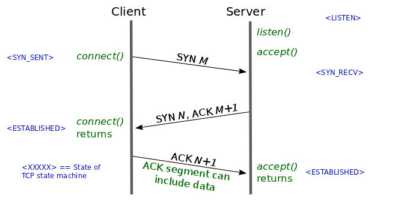

# 22.03.30

## 네트워크

### GET과 POST 비교
둘 모두 HTTP 프로토콜을 이용해 서버에 무엇인가를 요청할 때 사용하는 방식.  
#### GET
요청하는 데이터가 HTTP Request Message의 Header 부분에 url이 담겨서 전송된다.  
따라서 url상에서 `?`뒤에 데이터를 붙여 request를 보낸다.  
url에 데이터가 붙어서 가기 때문에 큰 데이터를 보낼 수 없고,  
url에 데이터가 그대로 노출되기 때문에 보안이 필요한 경우에는 적절하지 않다.  
#### POST
POST방식의 request는 HTTP Request Message의 Body부분에 데이터가 담겨서 전송된다.  
GET에 비해 더 큰 데이터를 보낼 수 있고, 보안면에서 쪼금 더 낫다.  
#### 차이
GET은 SELECT와 같이 데이터를 가져올 때 주로 사용하고, POST는 서버의 값이나 상태를 변경하거나 추가하기 위해서 사용한다.  
GET방식의 요청을 브라우저에서 caching할 수 있다. 따라서 데이터가 작다는 이유로 POST방식으로 전송해야 할 것을 GET방식으로 전송할 경우 캐싱되었던 데이터가 응답될 수 있다.  

### 3way, 4way handshaking
3way는 연결을 성립할때 사용하고, 4way는 연결을 해제할 때 사용한다.  
#### 3-way-handshaking
  
1. 클라이언트는 서버에 접속을 요청하는 SYN(a) 패킷을 보낸다.  
2. 서버는 SYN(a)를 받고, 응답인 ACK(a+1)와 SYN(b)를 클라이언트에게 보낸다.  
3. 클라이언트는 ACK(a+1), SYN(b)를 받고 SYN(b+1)을 서버에게 보내면 연결이 성립된다.  
#### 4-way-handshaking
  
1. 클라이언트가 연결을 종료하겠다는 FIN을 전송한다.  
2. 서버는 클라이언트의 FIN 요청을 받고 ACK를 전송한 후, 데이터를 모두 보낼 때 까지 대기한다.  
3. 서버가 데이터를 모두 보냈다면, FIN을 클라이언트에게 전송한다.  
4. 클라이언트는 FIN 메세지를 확인했다는 ACK를 보낸다.  
5. 클라이언트의 ACK메세지를 받은 서버는 소켓을 닫는다.  
6. 클라이언트는 덜 받은 데이터가 있을 경우를 대비해 일정시간 동안 세션을 남기고 대기한다.  
#### 기타사항
1. TCP Header에는 Code Bit(Flag bit)라는 부분이 존재한다. 이 부분은 총 6비트로 이루어져 있고, 각각 `Urg-Ack-Psh-Rst-Syn-Fin`순서로 되어있으며 해당 위치의 비트가 1이면 해당 패킷이 어떤 내용을 담고 있는 패킷인지를 나타낸다.  
2. 연결을 성립하기 위해서는 서로 통신이 가능한지를 먼저 파악하기 위해서 패킷을 먼저 주고 받아야 한다. 요청과 응답에 대한 패킷을 주고 받아야하기 때문에 Syn과 Ack를 주고 받는 것이다.  
3. TCP 연결은 양방향 연결이기 때문에, `클라이언트의 요청 - 서버의 응답`과 `서버의 요청 - 클라이언트의 응답`을 모두 확인해야 하므로 2way로는 부족하다.  
4. 처음 클라이언트에서 SYN 패킷을 보낼 때 Seq-Num을 난수로 설정하는데, 서버와 클라이언트가 연결할 때 사용하는 포트는 유한한 범위 내에서 사용하고, 시간이 지남에 따라서 재사용된다. 따라서 두 통신 호스트가 과거에 사용된 포트 번호 쌍을 사용할 가능성이 존재한다. 서버는 패킷의 SYN을 보고 패킷을 구분하는데, 난수가 아닌 순차적인 숫자가 전송된다면 이전의 연결과 차이를 알 수 없다. 이를 방지하기 위해서 난수로 ISN을 설정한다.  

### TCP, UDP
#### UDP
UDP는 비연결형 프로토콜이다. IP 데이터그램을 캡슐화하여 보내는 방법과 연결 설정을 하지 않고 보내는 방법이 있다. UDP는 흐름제어, 오류제어, 손상된 세그먼트의 수신에 대한 재전송을 하지 않는다. UDP는 포트를 사용해 IP 프로토콜에 인터페이스를 제공하는 것만 제공한다.  
클라이언트는 서버로 짧은 요청을 보내고, 짧은 응답을 기대한다. 만약 요청이나 응답이 손실된다면 클라이언트는 time out되고 다시 시도하면 된다. 코드가 간단하고, TCP의 초기설정에서 요구되는 프로토콜보다 적은 메시지가 필요하다.  
UDP를 사용한 것들 중에는 DNS가 있다. 어떤 호스트 네임의 IP주소를 찾을 필요가 있는 프로그램은 DNS서버로 호스트네임을 포함한 UDP 패킷을 보낸다. 이 서버는 호스트의 IP주소를 포함한 UDP패킷으로 응답한다. 사전에 설정이 필요하지 않으며 그 후에 해제가 필요하지 않다.  
#### TCP
대부분의 인터넷 응용 분야들은 신뢰성과 순차적인 전달을 필요로 한다. UDP는 이를 만족시킬 수 없으므로 TCP가 생겨났다. TCP서비스는 송신자와 수신자 모두가 소켓이라고 부르는 종단점을 생성함으로써 이루어진다. TCP에서 연결 설정은 3-way-handshake를 통해 이루어진다.  
모든 TCP연결은 전이중, 점대점방식이다. 전이중이란 전송이 양방향으로 동시에 일어날 수 있음을 의미하며 점대점이란 각 연결이 정확히 2개의 종단점을 가지고 있음을 의미한다. TCP는 멀티 캐스팅이나 브로드캐스팅을 지원하지 않는다.  

### HTTP와 HTTPS
#### HTTP의 문제점  
- HTTP는 평문 통신이기 때문에 도청이 가능하다.
- 통신 상대를 확인하지 않기 때문에 위장이 가능하다. 
- 완전성을 증명할 수 없기 때문에 변조가 가능하다. 
#### TCP/IP는 도청 가능한 네트워크이다.
TCP/IP 구조의 통신은 전부 통신 경로 상에서 엿볼 수 있다. 패킷을 수집하는 것만으로 도청할 수 있다. 평문으로 통신을 할 경우 메시지의 의미를 파악할 수 있기 때문에 암호화하여 통신해야한다.  
보완방법  
1. 통신 자체를 암호화 `SSL(Secure Socket Layer)` or `TLS(Transport Layer Security)`라는 다른 프로토콜을 조합함으로써 HTTP의 통신 내용을 암호화할 수 있다. SSL을 조합한 HTTP를 HTTPS라 부른다.  
2. 콘텐츠를 암호화하여 운반할 경우 받은 측에서 암호를 해독하여 출력하는 처리가 필요하다.  
#### 통신 상대를 확인하지 않기 때문에 위장이 가능하다.  
HTTP에 의한 통신에는 상대가 누구인지 확인하는 처리는 없기 때문에 누구든지 리퀘스트를 보낼 수 있다. IP주소나 포트 등에서 그 웹 서버에 액세스 제한이 없는 경우 리퀘스트가 오면 상대가 누구든지 무언가의 리스폰스를 반환한다. 이러한 특징은 여러 문제점을 유발한다.  
1. 리퀘스트를 보낸 곳의 웹 서버가 원래 의도한 리스폰스를 보내야 하는 웹 서버인지를 확인할 수 없다. 
2. 리스폰스를 반환한 곳의 클라이언트가 원래 의도한 리퀘스트응 보낸 클라이언트인지를 확인할 수 없다.  
3. 통신하고 있는 상대가 접근이 허가된 상대인지를 확인할 수 없다.  
4. 어디에서 누가 리퀘스틑 했는지 확인할 수 없다.  
5. 의미없는 리퀘스트도 수신한다. -> DoS공격을 방지할 수 없다.  
보완방법  
위 암호화 방법으로 언급된 `SSL`로 상대를 확인할 수 있다. SSL은 상대를 확인하는 수단으로 증명서를 제공하고 있다. 증명서는 신뢰할 수 있는 제 3자 기관에 의해 발행되는 것이기 때문에 서버나 클라이언트가 실재하는 사실을 증명한다. 이 증명서를 이용함으로써 통신상대가 내가 통신하고자 하는 서버임을 나타내고 이용자는 개인 정보 누설 등의 위험성이 줄어들게 된다. 한 가지 이점을 더 꼽자면 클라이언트는 이 증명서로 본인 확인을 하고 웹 사이트 인증에서도 사용할 수 있다.  
